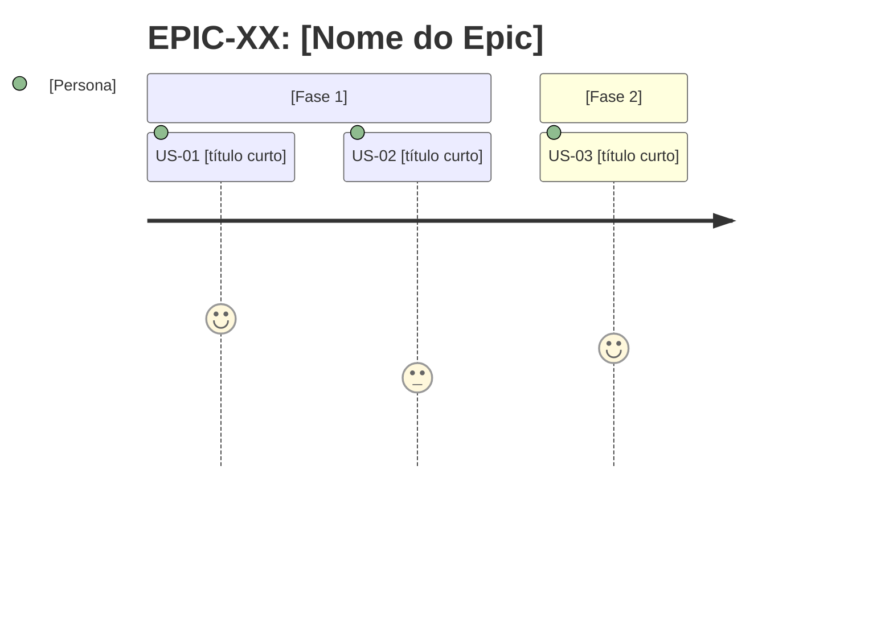

# SKILL: Planning

## Propósito
Esta skill define os padrões, templates e regras de qualidade para o Planner Agent produzir backlogs consistentes, rastreáveis e prontos para desenvolvimento.

---

## Templates canônicos

### Epic
```markdown
## EPIC-XX: [Nome do Epic]

**Objetivo:** [Uma frase: o que essa área entrega de valor para o negócio]
**Personas afetadas:** [Ex: Analista de BI, Administrador, Cliente final]
**Critério de sucesso:** [Métrica ou condição observável que indica que o Epic está completo]
**Dependências externas:** [APIs externas consumidas, design system, bibliotecas de terceiros]
**Prioridade:** Alta | Média | Baixa
**Stories:** [US-XX, US-YY, ...]
```

### User Story
```markdown
### US-XX: [Título curto e descritivo]

**Epic:** EPIC-XX
**Prioridade:** P0 — Deve Ter | P1 — Deveria Ter | P2 — Interessante Ter
**Como** [persona específica, não genérica],
**Quero** [ação concreta e observável],
**Para** [benefício de negócio ou objetivo do usuário].

**Critérios de aceite:**
- [ ] Given [estado inicial do sistema], When [ação do usuário ou evento], Then [resultado verificável]
- [ ] Given [estado inicial do sistema], When [ação do usuário ou evento], Then [resultado verificável]

**Notas técnicas:**
- [Referências a componentes, rotas, props, estado global, contratos de API consumidos pelo front]

**Estimativa:** P (< 4h, 1 componente ou ajuste isolado) | M (4–12h, múltiplos componentes ou fluxo de tela) | G (> 12h, feature com múltiplas telas — quebrar obrigatoriamente)
**Dependências:** [US-XX] | Nenhuma
**Status:** Backlog
```

---

## Framework INVEST

Antes de fechar qualquer Story, valide os 6 critérios INVEST:

| Critério | Pergunta de validação |
|---|---|
| **I — Independent** | Esta Story pode ser desenvolvida e entregue sem depender de outra em andamento? |
| **N — Negotiable** | O escopo pode ser ajustado sem perder o valor central? |
| **V — Valuable** | Entrega valor real e observável para uma persona? |
| **E — Estimable** | O time consegue estimar o esforço sem informações faltantes? |
| **S — Small** | Cabe em uma sprint ou ciclo de desenvolvimento? (= estimativa P ou M) |
| **T — Testable** | Todos os critérios de aceite são verificáveis por teste automatizado ou manual? |

Se qualquer critério falhar → reformule ou quebre a Story antes de incluí-la no backlog.

---

## Regras de granularidade

| Sinal | Ação |
|---|---|
| Story estimada como G (> 12h, feature com múltiplas telas) | Quebrar obrigatoriamente — G não vai para o Developer |
| Story tem mais de 6 critérios de aceite | Provavelmente é 2 stories |
| Story abrange mais de 2 telas ou fluxos distintos (ex: lista + detalhe + formulário) | Separar em stories por tela ou fluxo |
| Story depende de outra ainda não iniciada | Registrar dependência e reordenar |
| Backlog com mais de 15 Stories | Entregar por Epic — não processar o arquivo inteiro de uma vez |

---

## Regras para critérios de aceite

- Cada critério deve ser **testável de forma isolada** — se não dá para escrever um teste, reformule
- Use **Given/When/Then** sempre — evita ambiguidade sobre estado inicial
- **Given** descreve o estado do sistema, não a intenção do usuário
- **Then** deve ser verificável: prefira "exibe mensagem X" em vez de "funciona corretamente"
- Mínimo de 2 critérios por Story; se tiver apenas 1, a Story pode ser pequena demais

**Exemplos ruins vs. bons:**

❌ `O sistema deve funcionar bem quando o usuário logar`
✅ `Given que o usuário tem credenciais válidas, When ele submete o formulário de login, Then é redirecionado para o dashboard e vê seu nome no header`

❌ `Tratar erros`
✅ `Given que o usuário submete o formulário com e-mail inválido, When clica em "Entrar", Then vê a mensagem "E-mail inválido" abaixo do campo, sem recarregar a página`

---

## Padrão de numeração

```
EPIC-01, EPIC-02, ...
US-01, US-02, ...        ← numeração global, não por Epic
```

Stories são numeradas sequencialmente no projeto inteiro — facilita referência cruzada.

---

## Mapa de dependências

Ao final do `backlog.md`, inclua sempre:

```markdown
## Mapa de dependências

US-01 → (nenhuma)
US-02 → US-01
US-03 → US-01
US-04 → US-02, US-03
```

Use `→` para indicar "depende de". Se houver ciclo, é um erro de design — resolva antes de entregar o backlog.

---

## Checklist de qualidade do backlog

Antes de salvar o `backlog.md`, valide:

- [ ] Toda Story tem pelo menos 2 critérios de aceite no formato Given/When/Then
- [ ] Nenhuma Story está estimada como G sem justificativa de não quebrar
- [ ] Todas as dependências estão explícitas no mapa
- [ ] Não há ciclos de dependência
- [ ] Dúvidas em aberto estão marcadas com `⚠️`
- [ ] Personas usadas nas Stories estão definidas no `CLAUDE.md` ou no contexto do projeto
- [ ] A ordem das Stories no backlog respeita as dependências (stories sem dependência primeiro)

---

## Personas — como definir

Se o projeto não tiver personas definidas, o Planner deve listá-las antes de criar as Stories:

```markdown
## Personas do projeto

- **[Nome]:** [Quem é, o que faz, qual seu objetivo principal no sistema]
- **[Nome]:** [...]
```

Personas genéricas como "usuário" ou "admin" são permitidas apenas se o sistema realmente não distingue perfis.

---

## Customização via CLAUDE.md

O `CLAUDE.md` do projeto pode (e deve) sobrescrever partes desta skill. Ao ler o `CLAUDE.md`, extraia:

| O que procurar | Para usar em |
|---|---|
| Personas ou perfis de usuário definidos | Templates de User Story |
| Domínio de negócio e termos específicos | Linguagem dos critérios de aceite |
| Restrições técnicas (ex: framework de componentes, design system, rotas do router) | Notas técnicas das Stories |
| Componentes ou páginas existentes | Dependências e notas técnicas |

Se o `CLAUDE.md` não definir personas, o Planner deve criá-las no backlog antes de escrever qualquer Story.

---

## Estrutura final do backlog.md

```markdown
# Backlog

_Criado em: YYYY-MM-DD_
_Última atualização: YYYY-MM-DD_

---

## Personas
[lista de personas]

---

## Epics
[lista de epics com template canônico]

---

## Visão geral das Stories

| ID | Título | Persona | Prioridade | Epic | Status |
|----|--------|---------|------------|------|--------|
| US-01 | [título] | [persona] | P0 | EPIC-01 | Backlog |
| US-02 | [título] | [persona] | P1 | EPIC-01 | Backlog |

---

## User Stories por prioridade

### P0 — Deve Ter
> Sem estas Stories o produto não funciona ou não tem valor mínimo.

[stories P0 agrupadas por epic, em ordem de dependência]

### P1 — Deveria Ter
> Importantes para a experiência, mas não bloqueiam o lançamento.

[stories P1 agrupadas por epic, em ordem de dependência]

### P2 — Interessante Ter
> Desejáveis quando houver capacidade — não comprometem o ciclo atual se postergadas.

[stories P2 agrupadas por epic, em ordem de dependência]

---

## Mapa de dependências
[grafo textual]

---

## Mapas de jornada por Epic

> Incluir para cada Epic com 3 ou mais Stories em sequência obrigatória.
> Opcional para Epics com Stories paralelas ou independentes.



---

## Dúvidas em aberto
[lista de itens marcados com ⚠️ que precisam de resposta antes do desenvolvimento]
```
